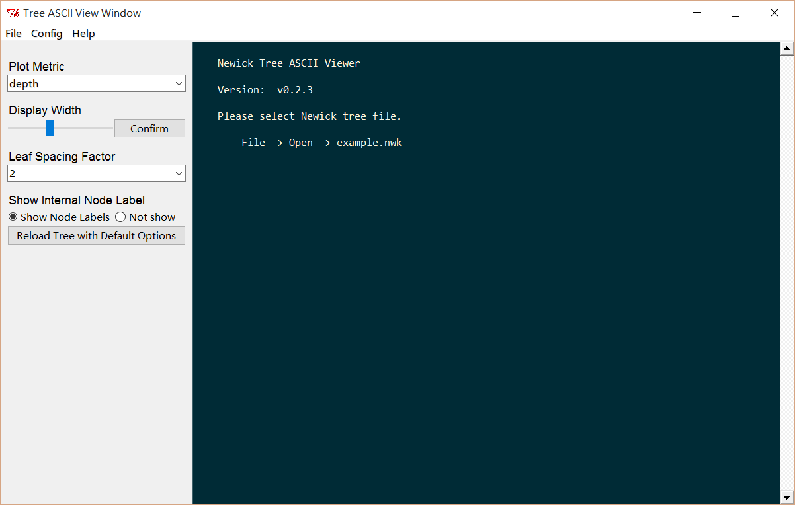

TreeASCIIView
=============
Provide a user friendly GUI for viewing Phylogenetic trees in ASCII style,
based on jeetsukumaran/DendroPy.

Screenshot
----------

Usage
-----

    pip install dendropy

Then double click `asciitree.py`.

Compatibility
-------------
Python: 2 or 3
Platforms: Windows, linux (Mac OS not fully tested).
