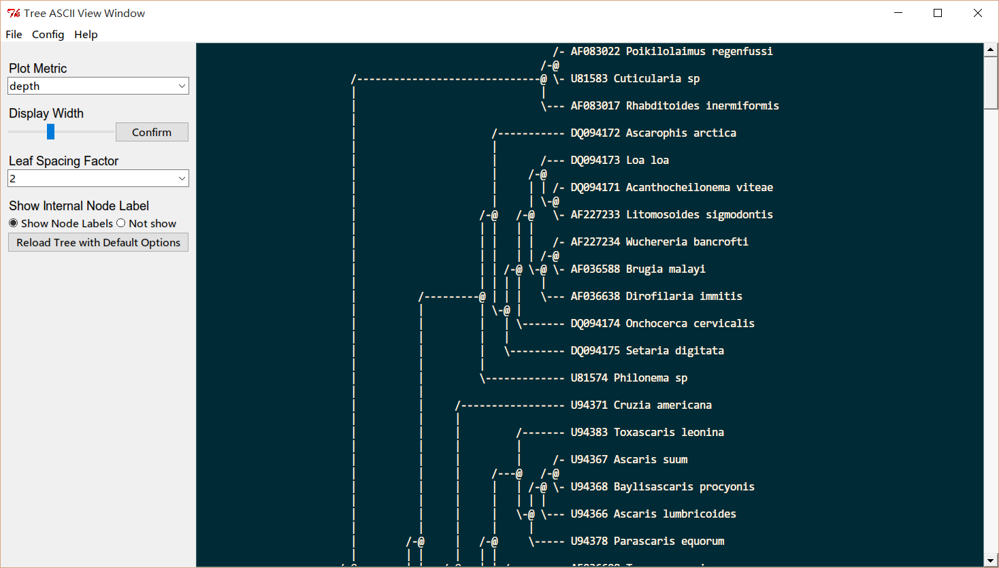

TreeASCIIView
=============
Provide a user friendly GUI for viewing Phylogenetic trees in ASCII style,
based on [jeetsukumaran/DendroPy](https://github.com/jeetsukumaran/DendroPy).

Screenshot
----------

Usage
-----

    pip install dendropy

Then download and double click `asciitree.py`. There will be a GUI for you.

Choose `File` - `Open` to open Newick tree.

You can modify these configurations if you need:

1. Plot Metric (Default: depth)
2. Display Width (Default: 100)
3. Leaf Spacing Factor (Default: 2)
4. Show Internal Node Label (Default: "Show Node Labels")

Compatibility
-------------
Python 2 & Python 3

Platforms: Windows, linux, and Mac OS (not fully tested).
